# LLM Token Caching: Why Prompt Prefixes Matter

## The Three Token Types and Their Costs

LLM APIs charge differently for three types of tokens:

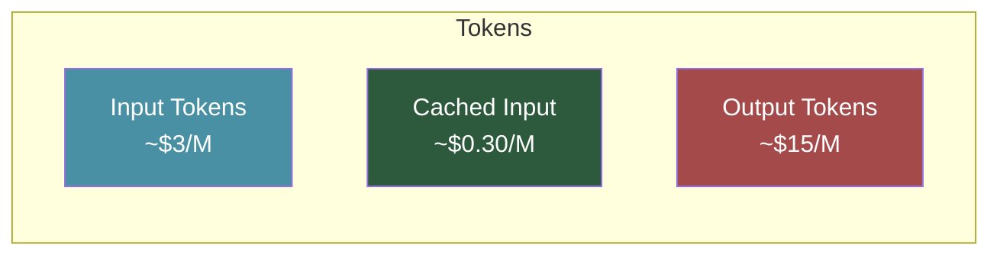

Typical ratio: **1x input : 0.1x cached : 5x output**

---

## Why Do Output Tokens Cost More?

Output tokens require autoregressive generation—each token needs a full forward pass through the model, one at a time:

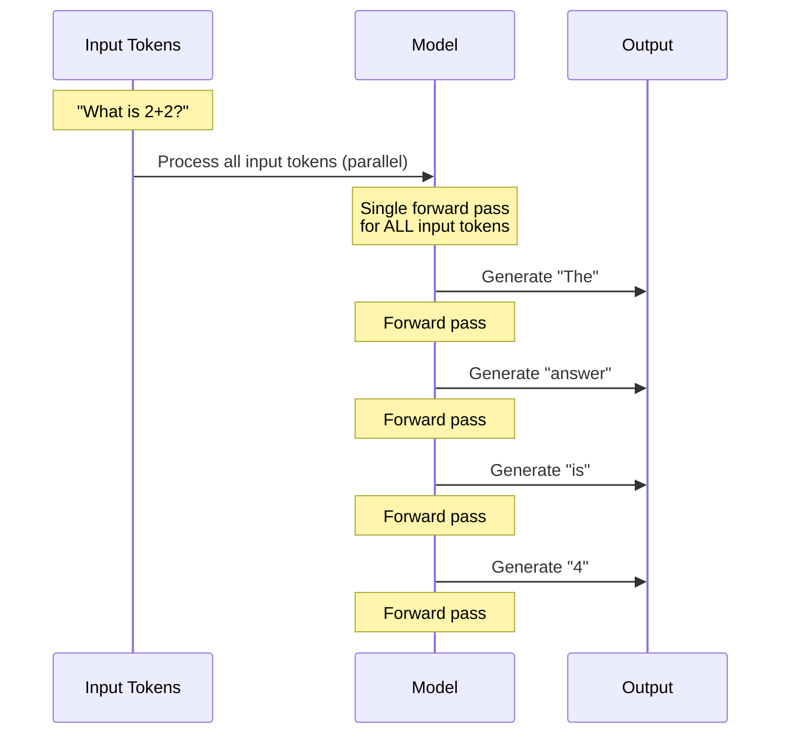

### Input vs Output Processing

```mermaid
flowchart TB
    subgraph Input["INPUT TOKENS (Cheap)"]
        direction LR
        I1[Token 1] & I2[Token 2] & I3[Token 3] & I4[Token 4]
        I1 & I2 & I3 & I4 --> IP[Single Parallel<br/>Forward Pass]
    end
    
    subgraph Output["OUTPUT TOKENS (Expensive)"]
        direction TB
        O1[Token 1] --> P1[Pass 1]
        P1 --> O2[Token 2] --> P2[Pass 2]
        P2 --> O3[Token 3] --> P3[Pass 3]
        P3 --> O4[Token 4] --> P4[Pass 4]
    end
    
    style Input fill:#1a3a1a
    style Output fill:#3a1a1a
```

**Key insight:** Input tokens can be processed in parallel (one GPU operation), but output tokens must be generated sequentially (one GPU operation per token).

---

## What Is the KV Cache?

During the forward pass, the model computes Key and Value tensors for attention. These are expensive to compute but can be reused:

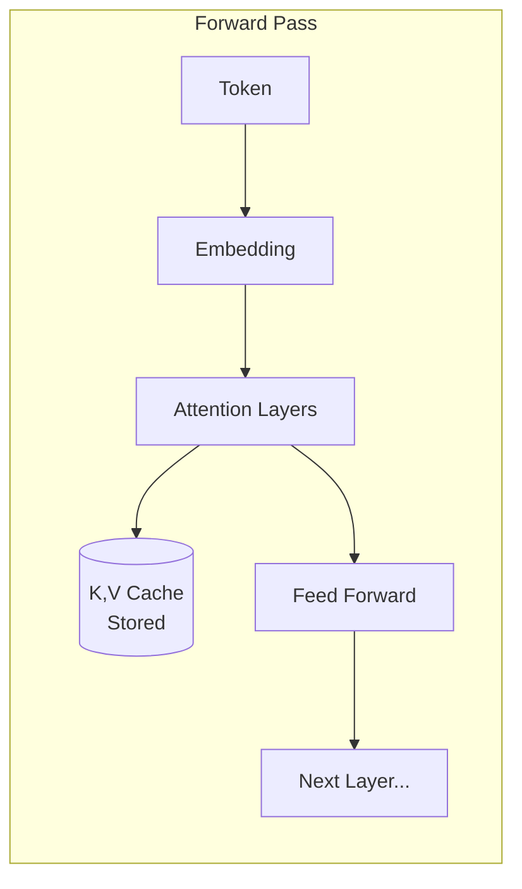

The KV cache stores intermediate computations so they don't need to be redone.

---

## How Caching Works Across API Calls

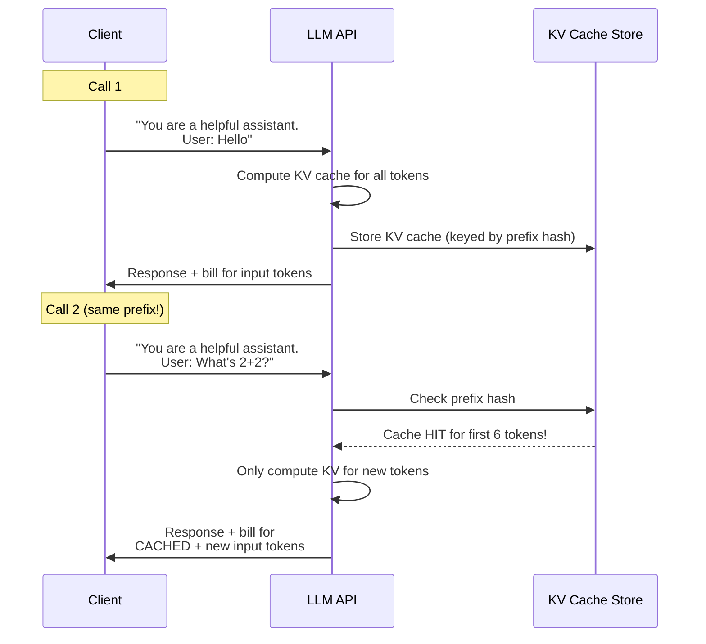

---

## The Prefix Matching Problem

Caching only works when the **initial tokens match exactly**. Any early difference invalidates the cache from that point forward:

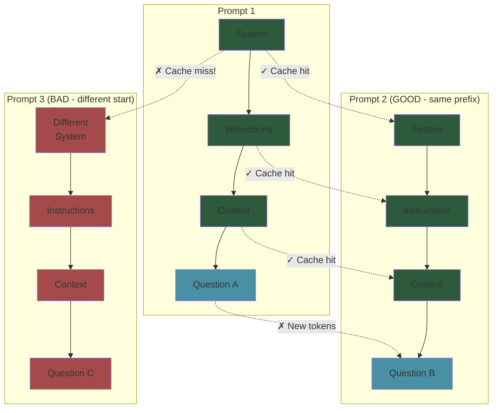

### Good vs Bad Sequential Prompt Design

```mermaid
flowchart LR
    subgraph Bad["❌ BAD: Variable prefix"]
        B1["[timestamp] System..."] --> B2["[timestamp] System..."]
        B2 --> B3["[timestamp] System..."]
    end
    
    subgraph Good["✓ GOOD: Stable prefix"]
        G1["System prompt<br/>+ Instructions<br/>+ [variable part]"]
        G2["System prompt<br/>+ Instructions<br/>+ [variable part]"]
        G3["System prompt<br/>+ Instructions<br/>+ [variable part]"]
        G1 --> G2 --> G3
    end
    
    style Bad fill:#3a1a1a
    style Good fill:#1a3a1a
```

---

## Cost Impact Visualization

For a conversation with 10 turns, each with 1000 token system prompt:

```mermaid
flowchart LR
    subgraph NoCaching["❌ Without Caching"]
        direction TB
        N1[Turn 1<br/>1000 tokens] --> N2[Turn 2<br/>2000 tokens]
        N2 --> N3[Turn 3<br/>3000 tokens]
        N3 --> N4[...]
        N4 --> N10[Turn 10<br/>10000 tokens]
    end
    
    subgraph WithCaching["✓ With Caching"]
        direction TB
        W1[Turn 1<br/>1000 tokens] --> W2[Turn 2<br/>1000 cached + 100 new]
        W2 --> W3[Turn 3<br/>1100 cached + 100 new]
        W3 --> W4[...]
        W4 --> W10[Turn 10<br/>1800 cached + 100 new]
    end
    
    style NoCaching fill:#3a1a1a
    style WithCaching fill:#1a3a1a
```

**Cumulative cost comparison:**
- Without caching: 1000 + 2000 + 3000 + ... + 10000 = **55,000 input tokens billed**
- With caching: ~10,000 full-price + ~45,000 at 10% = **~14,500 effective tokens**

---

## What About Generated Tokens for the Next Pass?

Yes! During generation, each output token's KV values are cached internally for generating subsequent tokens:

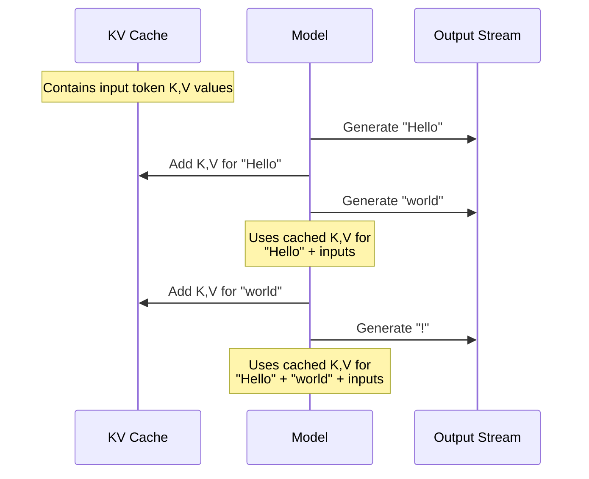

**But this internal caching is already priced into output tokens.** You pay the output token rate, which includes:
1. The forward pass to generate the token
2. The caching of that token's K,V for subsequent generation
3. The "value" of that token being usable as cached input in future API calls

---

## The Full Picture: Token Lifecycle and Pricing

```mermaid
flowchart TB
    subgraph Call1["API Call 1"]
        I1[Input Tokens<br/>$$$] --> KV1[(KV Cache<br/>Created)]
        KV1 --> G1[Generate Output<br/>$$$$$]
        G1 --> R1[Response]
    end
    
    subgraph Call2["API Call 2 (same prefix)"]
        I2a[Matching Prefix<br/>$] --> KV1
        I2b[New Input<br/>$$$] --> KV2[(KV Cache<br/>Extended)]
        KV1 --> KV2
        KV2 --> G2[Generate Output<br/>$$$$$]
        G2 --> R2[Response]
    end
    
    Call1 --> Call2
    
    style I1 fill:#4a90a4
    style I2a fill:#2d5a3d
    style I2b fill:#4a90a4
    style G1 fill:#a44a4a
    style G2 fill:#a44a4a
```

---

## Practical Guidelines

### DO ✓

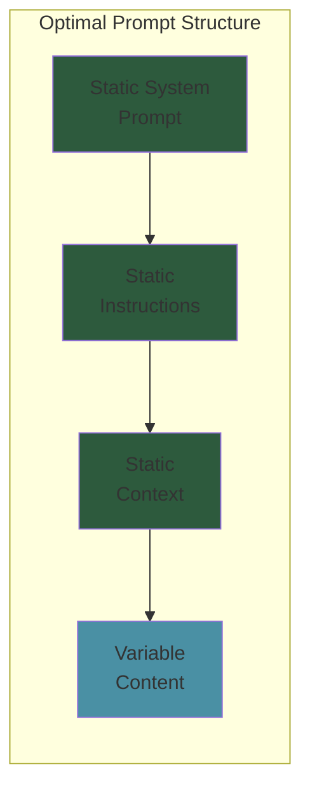

- Put static content (system prompts, instructions) **first**
- Put variable content (user queries, dynamic data) **last**
- Keep the same prefix across related calls

### DON'T ✗

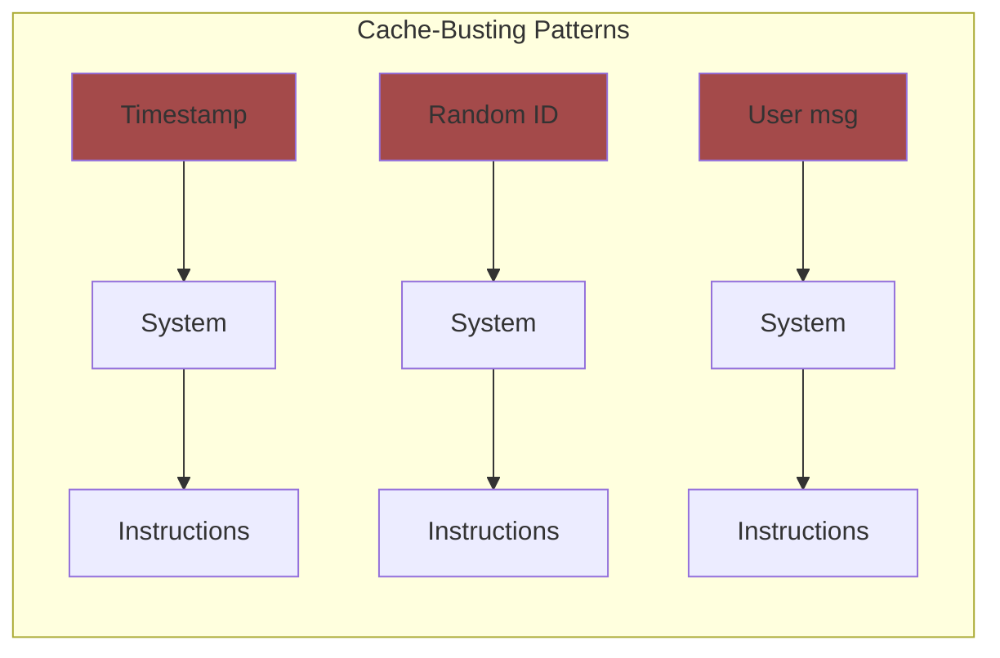

- Don't put timestamps, random IDs, or variable content at the start
- Don't reorder sections between calls
- Don't use different system prompts for related queries

---

## Summary

| Token Type | Cost | Why |
|------------|------|-----|
| **Input** | Medium | Single parallel forward pass |
| **Cached Input** | Low (~10%) | Reuses pre-computed KV cache |
| **Output** | High (~5x) | Sequential passes, one per token |

**The key insight:** Structure your prompts so the stable parts come first. Every matching prefix token is ~90% cheaper than a fresh input token.
