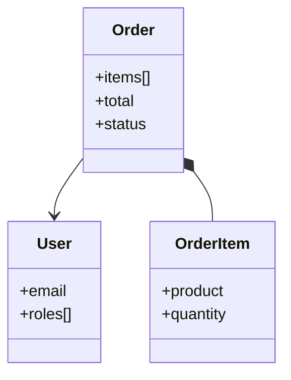
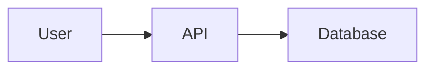
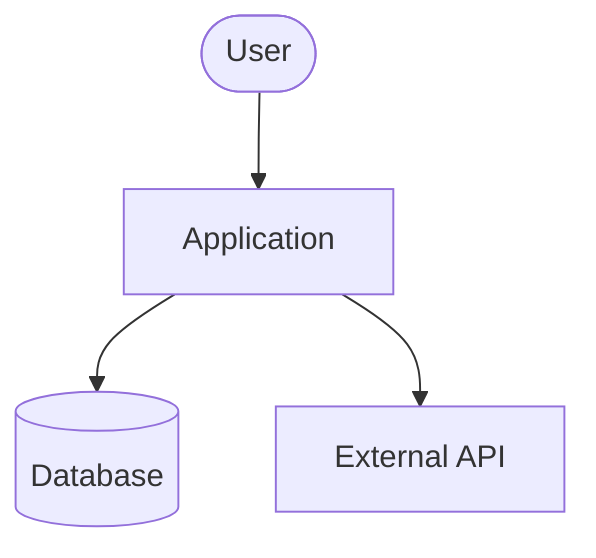
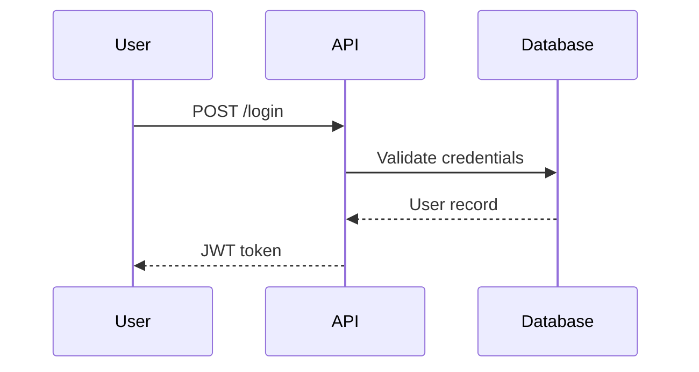

# Spec Folder

**⚠️ DO NOT MODIFY THIS FILE** - This is a documentation standards template owned by the meta-agent. If you need different conventions for a specific project, ask the human to update this template.

This file belongs in `spec/README.md` in your project.

The `spec/` folder contains **permanent system documentation** - the source of truth for how the system works.

## Purpose

Enable anyone (human or AI agent) to understand the current system quickly and accurately. Optimized for:
- **Agent consumption**: Token-efficient, structured, factual
- **Human review**: Scannable, visual diagrams, clear navigation
- **Collaboration**: Shared understanding across team members and tools

## Core Principle

**"Behavior and integration points clear, implementation details minimal"**

Document WHAT the system does and HOW components connect - enough to plan changes without surprises, not enough to implement without reading code.

## Structure

```
spec/
  README.md                      # This file - documentation standards
  current-system.md              # System overview (<500 lines)
  feature-tests.md               # Feature registry + verification methods

  system/                        # Detailed docs (when needed)
    components/
      <component-name>.md        # Deep dive on specific component
    flows/
      <flow-name>.md             # Critical multi-component flows
    domain/
      <area>.md                  # Domain entities and relationships
```

Diagrams are **inline** using Mermaid syntax - no separate diagram files needed.

## Progressive Disclosure (C4-Inspired)

Documentation reveals detail in layers - start with the big picture, drill down only as needed.

| Level | What | Where | Target Size |
|-------|------|-------|-------------|
| **1: Context** | System purpose, users, external dependencies | `current-system.md` | 100-200 lines |
| **2: Components** | Major components, connections, data flows | `current-system.md` | 200-400 lines |
| **3: Details** | Internal architecture of complex components | `system/components/*.md` | 200-400 lines each |
| **Flows** | Critical multi-component sequences | `system/flows/*.md` | As needed |
| **Domain** | Key entities, services, extension points | `system/domain/*.md` | As needed |

**Threshold**: Keep `current-system.md` under 500 lines (Levels 1+2). Split to Level 3 files when any component needs more than ~150 lines.

## What to Document

### Include
- Component responsibilities (what each major piece does)
- Data flows (how information moves through the system)
- Integration points (external services, APIs, data contracts)
- Key constraints (technical limitations, must-preserve behaviors)
- Configuration (what's configurable, where, critical settings)
- File references (`file_path:line_number` for key code locations)

### Exclude
- Implementation algorithms (unless they're critical constraints)
- Full class hierarchies (list major classes, not every method)
- Code walkthroughs ("first X, then Y, then Z")
- Historical decisions (unless they constrain future work)

### The Test
**"Could someone plan a new feature without missing critical constraints or breaking existing behavior?"**
- If yes → documentation is complete enough
- If no → missing critical integration points or constraints

## Class/Service Structure (When Needed)

For systems with significant OO or service-oriented architecture, document at the class level when a component's behavior can't be understood without knowing its structure.

**Document:**
- **Key domain entities** - Core business objects and their relationships (User, Order, Product)
- **Service interfaces** - Contracts between components: method signatures, return types
- **Extension points** - What can be plugged in, extended, or overridden

**Location**: Within `system/components/<component>.md` or dedicated `system/domain/<area>.md`

**Class diagrams** show relationships, not full implementation:



**Include**: Key properties, relationships, cardinality, public interfaces
**Exclude**: Every method, private fields, implementation details

## Diagrams

Visual diagrams dramatically improve comprehension. Use **Mermaid** for inline, version-controlled diagrams that render directly in GitHub, GitLab, Obsidian, and VS Code.

**Inline in markdown** - no separate files, no build step:

~~~markdown

~~~

**Recommended diagram types**:

| Purpose | Mermaid Type | Use For |
|---------|--------------|---------|
| System context | `flowchart` | System boundary, external actors/systems |
| Components | `flowchart` | Major components and connections |
| Sequences | `sequenceDiagram` | Critical interaction flows |
| Classes/Entities | `classDiagram` | Domain models, service interfaces |
| State machines | `stateDiagram-v2` | Lifecycle of key entities |

**Example - system context**:



**Example - sequence flow**:



Docs: [mermaid.js.org](https://mermaid.js.org/)

## Feature Tests Registry

`feature-tests.md` tracks what features exist and how to verify them:

```markdown
## Feature: User Authentication

**Description**: Users can log in with email/password
**Test Type**: Automated (pytest)
**Location**: `tests/test_auth.py`
**Last Verified**: 2025-11-15 ✅
```

This serves as a living checklist - anyone can verify the system works by running through the registry.

## Document Standards

- **Filenames**: Lowercase with hyphens (`current-system.md`)
- **YAML frontmatter**: Include metadata (date, git_commit, status)
- **Navigation**: Cross-link between overview and detail docs
- **Style**: Concise, technical, scannable. Bullet points over prose.

## What Does NOT Belong Here

| Don't Put | Why | Where Instead |
|-----------|-----|---------------|
| Work-in-progress | Spec is for current truth | Separate WIP folder |
| Recommendations | Document facts, not opinions | Design docs/tickets |
| Change history | Git tracks this | Git log |
| Session notes | Transient, not permanent | Delete after use |

## Key Principles

1. **Current state only** - Document what IS, not what WAS or SHOULD BE
2. **Progressive disclosure** - Overview first, details on demand
3. **Rewrite, don't append** - Keep docs current, not historical
4. **Delete aggressively** - If it's outdated or redundant, remove it
5. **Optimize for the reader** - Whether human or agent, they need facts fast
