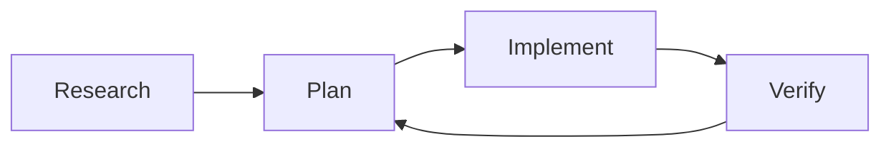
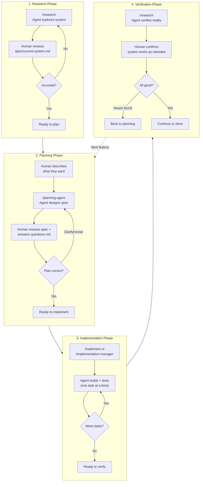
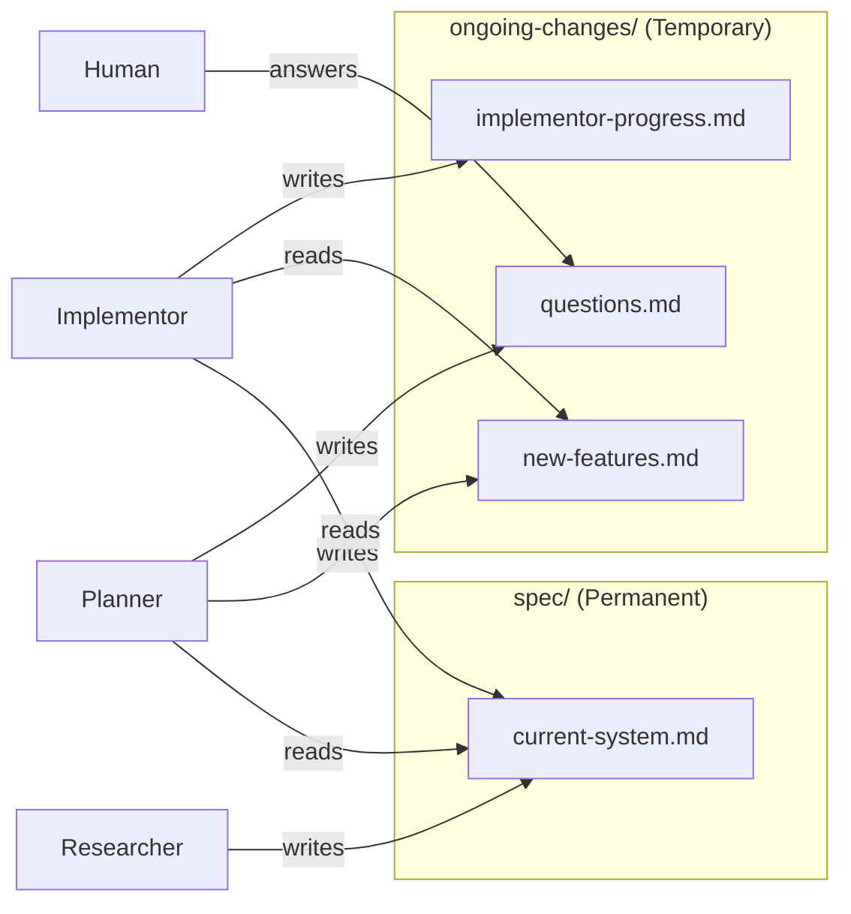

# Looped Agent Workflow System

**Version**: 1.3
**Last Updated**: 2026-02-02

**Recent improvements**: Consolidated meta-agent instructions into AGENTS.md; clarified 4-agent workflow system for project work (research, plan, implement, manager)

## What This Is

A system for using coding agent instances (Claude, GPT-5, Gemini, etc.) in loops to research, plan, and implement software projects. Four specialized agent prompts work together through shared documentation, with clean handoffs between sessions.

**The Problem**: Coding agents have finite context (e.g., 200k tokens for Claude Sonnet). Complex projects need multiple sessions with clean handoffs and minimal context bloat.

**The Solution**: Four specialized agents with clear document ownership, token-efficient status docs, and sub-agent delegation for verbose work.

---

## Agent Roles

### Researcher (`research.md`)
- **Purpose**: Investigates existing system OR verifies implementation
- **Owns**: `spec/current-system.md`, `spec/research-status.md`
- **Uses**: Task agents for codebase exploration
- **When**: At project start, or after implementation to verify reality

### Planner (`planning-agent.md`)
- **Purpose**: Designs specs for new work (WHAT to build, not HOW)
- **Owns**: `ongoing-changes/new-features.md`, `ongoing-changes/planning-status.md`, `ongoing-changes/questions.md`
- **Uses**: Task agents for feasibility research, questions.md for human collaboration
- **When**: After understanding current system, before implementation

### Implementor (`implement.md`)
- **Purpose**: Implements ONE atomic task per session, then STOPS
- **Owns**: `ongoing-changes/implementor-progress.md` (+ marks completions in new-features.md)
- **Uses**: Task agents for debugging, testing, exploration
- **When**: Repeatedly, one task at a time, until features complete

### Manager (`implementation-manager.md`)
- **Purpose**: Orchestrates multiple implementor sessions autonomously
- **Owns**: `ongoing-changes/manager-progress.md`
- **Uses**: Implementor agents for task execution
- **When**: For multi-task workflows where human oversight isn't needed per task

**Note**: To work on the agent system itself (refining prompts, docs, workflow), see `AGENTS.md` in the repository root.

---

## The Development Cycle

### High-Level Overview



Each phase involves human-agent collaboration. The cycle continues until the project is complete.

### Detailed Phase Interactions



### Document Flow



**Key**: Agents don't assume who comes next. Each keeps their owned docs current for whoever needs them.

**Two-directory structure**:
- `spec/` - Permanent system knowledge (researcher territory)
- `ongoing-changes/` - Temporary work-in-progress (planner/implementor/manager territory)

---

## Document Structure

```
~/dotfiles/agents/
  commands/
    research.md                - Research agent (invoke: /research)
    planning-agent.md          - Planning agent (invoke: /planning-agent)
    implement.md               - Implementor agent (invoke: /implement)
    implementation-manager.md  - Manager agent (invoke: /implementation-manager)

  workflow.md                - This file (user guide)
  meta/status.md             - System state and development history
  meta/ace-fca-comparison.md - Lessons from similar systems

~/dotfiles/
  AGENTS.md                  - Instructions for working on agent system itself

(In target projects - created by agents during usage)
spec/                           - Permanent system documentation
  current-system.md             - System understanding (researcher)
  research-status.md            - Research progress (researcher)

ongoing-changes/                - Temporary work-in-progress documents
  new-features.md               - What to build (planner)
  planning-status.md            - Planning progress (planner)
  questions.md                  - Human Q&A (planner, temporary)
  implementor-progress.md       - Implementation state (implementor)
  manager-progress.md           - Task tracking (manager)
```

### Document Ownership

**spec/README.md** - Documentation standards (permanent, read-only)
- Created by: Researcher (initialized from template if missing)
- Read by: All agents
- **NEVER modified by agents** - this is a template file
- If conventions need updating: Ask human to update `~/dotfiles/agents/spec-README-template.md`

**spec/current-system.md** - System understanding (permanent)
- Created/updated by: Researcher
- Read by: Planner, Implementor
- Living doc: updated as system evolves
- Principle: "Behavior and integration points clear, implementation details minimal"
- For large systems (>800-1000 lines): Split into spec/system/ subdocs

**ongoing-changes/new-features.md** - Functional requirements (temporary)
- Created/updated by: Planner
- Read by: Implementor, Manager
- Marked complete by: Implementor
- Deleted when project phase complete

**ongoing-changes/implementor-progress.md** - Implementation state (temporary)
- Created/updated by: Implementor
- Read by: Next implementor, Manager
- Structure: "What's Done / What's Next / Dependencies"
- REWRITE each session (not append-only)

**ongoing-changes/questions.md** - Structured human Q&A (temporary)
- Created/updated by: Planner (ONLY)
- Read by: Human, then planner
- Format: Context, options, recommendation, HUMAN RESPONSE placeholder
- Delete answered questions immediately (not archive)

---

## Diagrams in Documentation

**Agents use Mermaid diagrams inline** in system and planning documentation. These render natively in GitHub, GitLab, Obsidian, VS Code, and most markdown viewers.

### Where You'll Find Diagrams

**current-system.md** (from Researcher):
- Flowcharts showing system architecture
- Sequence diagrams for critical data flows
- Class diagrams for key entities

**new-features.md** (from Planner):
- Flowcharts highlighting what's changing
- Sequence diagrams showing new feature flows

### Viewing Mermaid Diagrams

**No setup required** - Mermaid renders natively in:
- GitHub / GitLab (inline in markdown)
- VS Code (with built-in markdown preview)
- Obsidian, Notion, and most modern markdown tools

**VS Code**: Just open the markdown file and use `Cmd+Shift+V` (Mac) or `Ctrl+Shift+V` (Windows/Linux) to preview.

### Why Diagrams Matter

**For reviewing specs**:
- Instantly see which components are affected
- Spot missing integration points
- Understand data flows at a glance
- Identify scope creep or over-complexity

**For collaboration**:
- Share rendered diagrams with team
- Point to specific diagram elements in discussions
- Much faster than reading prose descriptions

**Example**: Instead of reading "The API Server connects to the Email Service via AMQP, which then integrates with SendGrid using their REST API...", you see a clear component diagram with connections labeled.

---

## How to Use This System

### Starting an Agent

**If using Claude Code with slash commands:**
```
/research                # Investigate or verify system
/planning-agent          # Design new features
/implement               # Build one task at a time
/implementation-manager  # Orchestrate multiple tasks
```

**If using other agents or file references:**
```
Please act as the researcher agent from ~/dotfiles/agents/commands/research.md
Please act as the planner agent from ~/dotfiles/agents/commands/planning-agent.md
Please act as the implementor agent from ~/dotfiles/agents/commands/implement.md
Please act as the manager agent from ~/dotfiles/agents/commands/implementation-manager.md
```

**To work on the agent system itself:** See `AGENTS.md` in the repository root for instructions.

**Note**: Slash commands work with Claude Code CLI. Other agents (GPT-5, Gemini, etc.) may require different invocation methods.

### Continuing Work

Each agent reads their status docs and continues from where the previous agent left off. No need to explain history - they pick up context from the documents.

### Project-Specific Rules

**Location**: `.agent-rules/` directory in your project root

As you work with agents on a project, you'll discover patterns that should ALWAYS be followed:
- Tool-specific workflows (Unity domain reloads, Unreal builds)
- Project conventions (port ranges to avoid, file patterns)
- Required sequences ("always run X after Y")
- Known gotchas ("never manually edit .meta files")

**Instead of repeating these instructions every session**, save them as permanent project rules.

**How it works:**

1. **Agent encounters a workflow**: You explain "after changing Unity files, always reload the domain via UnityMCP server"
2. **Agent completes the task successfully**
3. **You say**: "Add this as a rule"
4. **Agent appends to `.agent-rules/implementation.md`** with token-efficient format:
   - **Context**: When this applies (trigger condition)
   - **How**: Specific commands and verification

5. **Future implementors read the rules** during entry point and follow them automatically

**Example rule (concise format):**
```markdown
## Unity Domain Reload
**Context**: After changing .cs files
**How**: Run `mcp__unity__unity_trigger_reload()`, then `mcp__unity__unity_get_console_logs(logType="Error")`. Fix errors before proceeding.
```

**Why concise:** Rules are token-efficient - only document what the agent can't infer (specific commands for THIS project), not what it already knows (why Unity needs compilation).

**Rules files:**
- `.agent-rules/implementation.md` - Rules for implementors
- `.agent-rules/research.md` - Rules for researchers
- `.agent-rules/planning.md` - Rules for planners

**When to add rules:**
- Only when you explicitly say "add this as a rule"
- After successful task completion (capture what worked)
- When you find yourself repeating the same instruction multiple times

**Benefits:**
- Permanent project knowledge (travels with codebase)
- Reduces repeated clarifications
- Captures tool-specific workflows
- Accumulates learnings across sessions

**Permanent project knowledge**: Agent rules document "how to BUILD features in this project" - workflows, gotchas, and constraints that accumulate over time.

---

## Key Principles

### System Documentation Principle

**For spec/current-system.md**: "Behavior and integration points clear, implementation details minimal"

Document WHAT the system does and HOW components connect - enough to plan changes without surprises, not enough to implement without reading code.

**Include**:
- Component responsibilities and data flows
- Integration points (APIs, external systems, data formats)
- Key constraints (technical limits, dependencies)
- User-facing behavior and workflows

**Exclude**:
- Implementation algorithms (unless critical constraints)
- Full class hierarchies and method signatures
- Line-by-line code walkthroughs
- Historical decisions (unless they constrain future work)

**Multi-file strategy for large systems** (>800-1000 lines):
```
spec/
  current-system.md           - Overview + navigation (200-300 lines)
  system/
    architecture.md           - Components, data flows
    integration-points.md     - APIs, contracts, data formats
    constraints.md            - Technical debt, limitations
```

### Spec Documentation Principle

**For ongoing-changes/new-features.md**: "User experience clear, implementation flexible"

Two implementors should produce systems that behave identically from user perspective, but could have different internals.

### Documentation is NOT History

Documents are for FUTURE AGENTS, not historical record.

**DELETE**:
- Completed tasks
- Old problems that were solved
- Session narratives
- "What we tried"

**KEEP**:
- Current state
- Active decisions
- Next steps
- Blockers

**REWRITE sections** when info changes (don't append).

### Token Efficiency

- **60-70% usage**: Wrap up, write docs, exit
- **80% usage**: HARD STOP - document state immediately
- Delegate verbose work to Task sub-agents
- Read all docs completely (no summaries)

### Quality Standards

**Planner specs**:
- Focus on interfaces, behavior, workflows
- 2-3 phases max (not 5+)
- Two implementors = same user behavior, different internals

**Implementor code**:
- Simple > clever, Clear > DRY, Less is better
- ONE task per session, then STOP
- Mandatory end-to-end user testing with evidence
- "Replace X" means replace X (not create X_v2)

---

## QUESTIONS.md Workflow

**Critical for async human-agent collaboration**:

1. **Planner adds question** with structure:
   - Context, options with tradeoffs, recommendation
   - **HUMAN RESPONSE:** placeholder

2. **Human edits file** with decision (can be brief: "Option A")

3. **Next planner session**:
   - Reads responses, updates specs
   - **Deletes answered questions** (don't archive)

**Why this works**:
- Numbered questions easy to reference (Q1, Q2, etc.)
- Human reviews all questions holistically
- Better than conversational back-and-forth
- Async-friendly

---

## Running Checkpoint Reviews

**After 2-3 implementation sessions**, or when documentation feels stale:

```
/research
Task: Verify specs match implementation reality, check for regressions
```

**What they check**:
- Does `spec/current-system.md` match actual code?
- Are features marked "ENABLED" actually working?
- Did recent changes break previous features?
- Are there contradictions between docs?

**Cost**: ~30-40% context per checkpoint
**Benefit**: Catches drift before it compounds

---

## When Things Go Wrong

**Symptoms of drift:**
- Docs claim feature works but it doesn't
- Tests passing but feature broken
- Multiple versions of "current state" in different files
- Implementors confused about what exists

**Action**: Stop implementation, run checkpoint researcher to reset shared understanding.

---

## Common Pitfalls

### Historical Accumulation
Agents treat docs like append-only logs.
→ **Solution**: REWRITE, don't append. Delete obsolete info.

### Multi-Task Creep
Implementors continue to next task when they have context.
→ **Solution**: ONE TASK PER SESSION rule. STOP after one task.

### Fake Verification
Agents claim "works" without testing.
→ **Solution**: Mandatory end-to-end testing with evidence (commands + output).

### Spec Reinterpretation
Agents create _v2 files when spec says "replace".
→ **Solution**: Follow spec literally. If unclear, ask.

### Code-Heavy Specs
Planner dumps implementation code instead of requirements.
→ **Solution**: Focus on interfaces and behavior, not code dumps.

---

## Tips for Success

1. **Start with researcher** to understand existing system
2. **Use planner for feature design** with human collaboration via QUESTIONS.md
3. **Run implementor in loops**, one atomic task per session
4. **Run checkpoint reviews** every 2-3 implementations
5. **Keep specs simple**: 2-3 phases max
6. **Delete obsolete info**: Docs are for future, not history
7. **Verify everything**: End-to-end testing is mandatory

---

## Document Purposes Quick Reference

**For Users:**
- `README.md` - End user usage guide (NO phases, NO implementation details)

**For Agent Handoffs:**
- `spec/current-system.md` - Researcher → Planner/Implementor
- `ongoing-changes/new-features.md` - Planner → Implementor/Manager
- `ongoing-changes/implementor-progress.md` - Implementor → Implementor

**For Agent Continuity (same role):**
- `spec/research-status.md` - Researcher → Researcher
- `ongoing-changes/planning-status.md` - Planner → Planner
- `ongoing-changes/manager-progress.md` - Manager → Manager

**For Human Interaction:**
- `ongoing-changes/questions.md` - Planner ↔ Human

**Key**: Agents only read handoff docs from previous role, not internal progress docs from other roles.

**Directory Structure**:
- `spec/` - Permanent docs (never deleted, continuously updated)
- `ongoing-changes/` - Temporary docs (deleted when project phase complete)

---

**Remember**: Agents need current state and next steps, not a story of how we got here.
