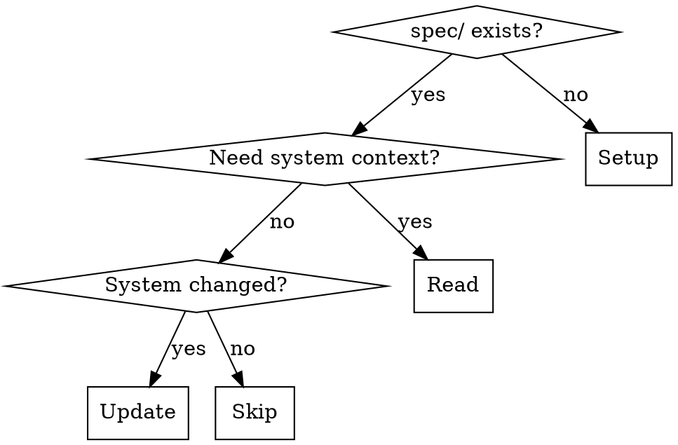

# System Documentation

Maintain a `spec/` folder as the permanent source of truth for how a system works. Three modes: setup, read, and update.

## When to Use

- **Setup**: Project has no `spec/` folder and would benefit from system documentation
- **Read**: Starting work that touches multiple components, planning a feature, debugging cross-cutting issues, or onboarding to an unfamiliar area
- **Update**: After implementation that changed architecture, added components, modified data flows, or altered external dependencies
- **Skip**: Scoped changes where you already understand the affected code (typo fixes, single-function changes, test additions)



## Mode: Setup

Create `spec/` with documentation standards and a system overview stub.

1. Create `spec/README.md` with the spec-readme template below (verbatim)
2. Create `spec/current-system.md` with the current-system stub below
3. If a project CLAUDE.md exists and doesn't reference spec files, suggest adding a pointer. If none exists, offer to create one.
4. Commit the scaffolding.

## Mode: Read

Load system context before doing work.

1. Read `spec/README.md` to understand documentation conventions
2. Read `spec/current-system.md` for the system overview
3. If the task touches a specific area and a detail doc exists (e.g. `spec/system/components/auth.md`), read that too
4. If `spec/current-system.md` is a stub or clearly outdated, offer to populate/update it before proceeding

Do NOT read the entire spec tree. Read the overview, then drill into detail docs only for the areas your task touches.

## Mode: Update

After implementation that changed the system, update the spec to match.

1. Identify what changed: new components, modified data flows, new external dependencies, changed architecture
2. Update `spec/current-system.md` — rewrite affected sections (don't append)
3. If a detail doc exists for the changed area, update it. If a new component warrants a detail doc, create one and add a summary + link in `current-system.md`
4. Delete anything that's no longer true
5. Commit spec updates separately from implementation

**The test**: After your update, could someone read `current-system.md` and plan a new feature without missing critical constraints?

## Spec Standards (for all modes)

### File Structure

```
spec/
  README.md              # Documentation standards (don't modify)
  current-system.md      # System overview (300 lines ideal, 500 max)
  system/                # Detail docs
    components/
      <name>.md          # Deep dive (150-250 lines)
    flows/
      <name>.md          # Multi-component flows
    domain/
      <name>.md          # Domain entities and relationships
```

### Core Principle: Summary + Link

Every complex topic gets a short summary in the parent doc, with a link to details. The summary must contain enough that a reader knows whether they need the detail doc.

```markdown
### Authentication

Handles user login via OAuth2 with JWT tokens. Sessions stored in Redis with 24h TTL.

> Details: [system/components/auth.md](system/components/auth.md)
```

### What to Document

- Component responsibilities and interactions
- Data flows for primary use cases
- Integration points and data contracts
- Key constraints and must-preserve behaviors
- File references (`file_path:line_number`)

### What NOT to Document

- Implementation algorithms (unless they're constraints)
- Full class hierarchies
- Code walkthroughs
- Historical decisions (unless they constrain future work)
- Work-in-progress (use design docs or plan files for that)

### C4 Model

Follow [C4](https://c4model.com/) levels of abstraction. Skip any level that adds no information.

| Level | Include When | Skip When |
|-------|--------------|-----------|
| Context | External systems or multiple user types | No external systems |
| Containers | Multiple deployable units | Single container |
| Components | Complex internals | Simple structure |
| Code | Important domain models | Covered at higher levels |

Diagrams use Mermaid inline. Label nodes with purpose, arrows with what flows.

### Document Standards

- Filenames: lowercase with hyphens
- YAML frontmatter: date, git_commit, status
- Style: concise, technical. Tables for facts, prose for relationships.
- **Rewrite, don't append.** Current state only.

## Templates

### spec-readme

The spec/README.md content is a documentation standard that should not be modified by agents. Use the setup-spec-readme.md template in this skill directory.

### current-system stub

```markdown
---
date: YYYY-MM-DD
git_commit: (run `git rev-parse --short HEAD`)
status: stub
---

# Current System

> Replace this stub with an accurate overview. Follow standards in `spec/README.md`.

## Overview

[1-2 sentence description of what this system does and who uses it.]

## Architecture

[C4 diagram or prose description of major components and interactions.]

## Key Components

[One section per major component: short summary, link to detail doc if warranted.]

## Data Flow

[How information moves through the system for primary use cases.]

## External Dependencies

[External services, APIs, databases this system depends on.]
```
